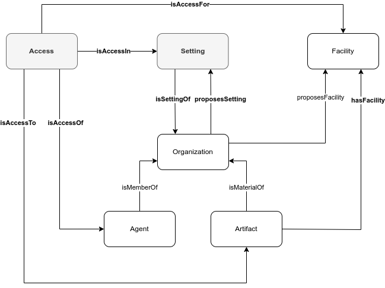

# Configure an Organization

## Description

The FL Logistics has a depot in Lyon and another in Saint-Étienne. Each depot has one _receive_ and one _pick_ setting.

In the _receive_ setting, agents have access to equipment that can handle (i.e., lift and move) pallets, and list the products in a pallet based on barcode.

In the _pick_ setting, agents have access to equipment that can handle (i.e., lift and move) pallets, and print barcode labels identifying the list the products in a pallet.

Forklifts are capable of lifting up and down materials on pallets to/from high shelves, as well as moving them from one location to another. Pallet jacks are capable of lifting up and down materials on pallets and move them from one location to another.

The barcode reader is capable of reading barcodes identifying materials recorded in the barcode. The label machine is capable of printing labels with barcode to identify materials.

Each depot makes available one forklift, one pallet jack, and one barcode reader in the _receive_ setting, and one forklift, one pallet jack, and one label printer in the _pick_ setting.

Marie, a collector in Lyon, can use the Forklift 1 and Pallet Jack 1 to unload trucks and the Barcode Reader 1 to check the pallet's content.

Nancy, a deliverer in Lyon, can use the Forklift 2 and Pallet Jack 2 to load trucks and the Label Printer 1 to print the labels identifying the pallet's content.

Leo, a collector and deliverer in Saint-Étienne, can use the Forklift 3 and Pallet Jack 3 to load and unload trucks, the Barcode Reader 2 to check the pallet's content, and the Label Printer 2 to print the labels identifying the pallet's content.

## Competency questions

| ID | Question in Natural Language | Example |
|----|------------------------------|---------|
| q1 | What are the artifacts that an agent of the organization X has access to in the setting Y?                                              | What are the artifacts that an agent of the FL Logistics has access to in the _receive_ setting? `ex:Barcode_Reader_1`, `ex:Barcode_Reader_2`, `ex:Forklift_1`, `ex:Forklift_3`, `ex:Palletjack_1`, `ex:Palletjack_3`                    |
| q2 | What are the settings of an organization X?                 | What are the settings of the FL Logistics? `ex:PickSetting`, `ex:ReceiveSetting` |
| q3 | What are the facilities that the artifact X have?           | What are the facilities that Forklift 1 has? `ex:LiftDown`, `ex:LiftUp`, `ex:Move`                                                                           |
| q4 | What are the agents currently in the setting Y?             | What are the agents currently in the _pick_ setting? `ex:Leo`, `ex:Nancy`        |
| q5 | What are the facilities that artifact X has in each access? | What are the facilities that the Forklift 1 has in each access? `ex:FL_Lyon_Receive_Move_Access,ex:LiftDown`, `ex:FL_Lyon_Receive_Move_Access,ex:LiftUp`, `ex:FL_Lyon_Receive_Move_Access,ex:Move`                                       |

## Glossary



* **Access**: An opportunity an Agent has to use Facilities of Artifacts in a Setting. Agents have access even if they never use these Facilities. One Access should not be understood as one 'use' of these Facilities.
* **Setting**: A Setting is the context in which an Access is set.
* **Facility**: see [Create an Organization](https://github.com/HyperAgents/ns.hyperagents.org/blob/master/domains/logistics/create-organization/README.md) scenario.
* **Organization**: see [Discover Organizations, their Members and Materials in Hypermedia Environments](https://github.com/HyperAgents/hmas/blob/master/domains/manufacturing-environments/discover-organization/README.md) scenario.
* **Agent**: see [Discover Organizations, their Members and Materials in Hypermedia Environments](https://github.com/HyperAgents/hmas/blob/master/domains/manufacturing-environments/discover-organization/README.md) scenario.
* **Artifact**: see [Discover Organizations, their Members and Materials in Hypermedia Environments](https://github.com/HyperAgents/hmas/blob/master/domains/manufacturing-environments/discover-organization/README.md) scenario.

## Recommendations

* The Access Constraint is represented as a SHACL shape instead of an RDF triple. For example, the SHACL shape constraining that the facilities referenced in the access are jointly provided by all the artifacts associated to that access.

```
ex:AccessFacilitiesShape a sh:NodeShape ;
    sh:targetClass hmas:Access ;
    sh:sparql [
        a sh:SPARQLConstraint ;
        sh:message "The artifacts associated to an access should jointly have all the facilities associated to that access." ;
        sh:prefixes ex:, hmas:, rdfs: ;
        sh:select """
          SELECT (?access as $this)
          WHERE {
            ?access hmas:isAccessFor ?facility .

            FILTER NOT EXISTS {
              ?access hmas:isAccessTo ?artifact .
              ?artifact hmas:hasFacility ?facility .
            }
          }
          """ ;
        ] .
```
