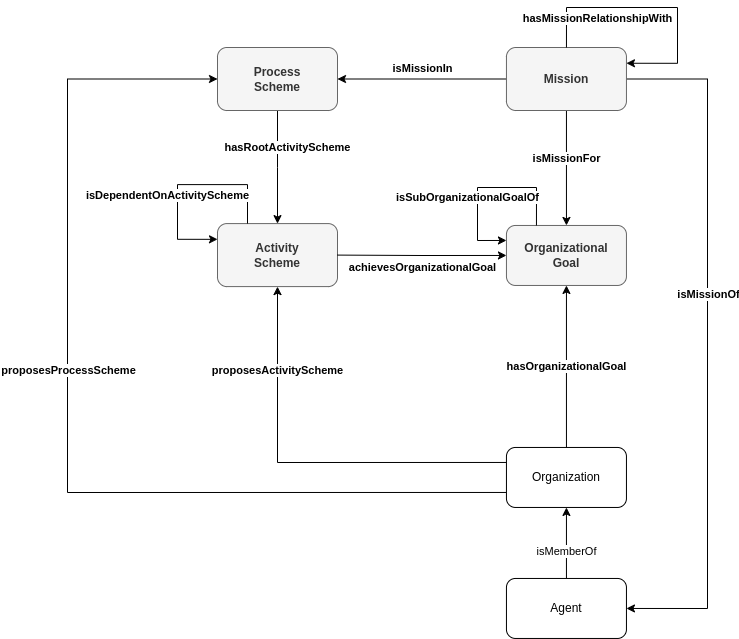

# Coordinate activities within an Organization

## Description

The new FL Logistics enterprise has different main organizational goals that can be pursued in parallel: hire employees, handle invoices, maintain client relationship, and plan and deliver goods. To achieve these goals, the enterprise has defined a set of processes:
* **hiring**: contract signed, candidates interviewed
* **handling invoice**: invoices processed, payable invoices payed, invoices payments received
* **prospecting client**: client relationship maintained, logistic services prospected, logistic services sold
* **delivering**: schedule delivery of goods optimized

The **hiring process** has a set of interdependent activities, i.e., **hiring**, the root activity, depends on the completion of the **signing contract** activity, that depends on the completion of the **selecting candidate** activity, that depends on the completion of the **assessing recommendations** and **interviewing candidates** activities, that depend on the completion of the **selecting interviewees** activity, that depends on the completion of the **announcing job position**, that finally depends on the completion of the **writing job position description**. The **assessing recommendations** activity facilitates the **interviewing candidates** activity and bias the **selecting candidate** activity.

Each of these activities is associated to an organizational goal, i.e., **hired**, **contract signed**, **candidate selected**, **recommendations assessed**, **candidates interviewed**, **interviewees selected**, **job position announced**, and **job position description wrote**. The organizational goal **candidates interviewed** has two sub-goals, **interviews scheduled** and **interviews conducted**. The organizational goals **hired**, **contract signed**, and **job position announced** are missions of the human resources, while the organizational goals **candidate selected**, **recommendations assessed**, **candidates interviewed** including its sub-goals, **interviewees selected**, and **job position description wrote** are missions of the department director.

A new person has to be hired in the Commercial department for the Account Manager job position. Frank, the Human Resources Officer, commits to the organizational goals under the human resources missions, while Kate, the Director of the Operations Department, commits to the organizational goals under the director missions.

## Competency questions

| ID | Question in Natural Language | Example |
|----|------------------------------|---------| 
| q1 | What are the organizational goals and subgoals agent Y has to achieve in the organization X? | What are the organizational goals and subgoals Kate has to achieve in the FL Logistics organization? `ex:FL_AccountManager_CandidateSelected`, `ex:FL_AccountManager_RecommendationsAssessed`, `ex:FL_AccountManager_CandidatesInterviewed`, `ex:FL_AccountManager_InterviewsScheduled`, `ex:FL_AccountManager_InterviewsConducted`, `ex:FL_AccountManager_IntervieweesSelected`, `ex:FL_AccountManager_JobPositionAnnounced`          |
| q2 | What are the agent Y's activities in the organization X and when they have to be performed?  | What are Frank's activities in the FL Logistics organization and in which order they have to be performed? `ex:FL_AccountManager_AnnouncingJobPosition`, `ex:FL_AccountManager_SigningContract`, `ex:FL_AccountManager_Hiring`                                                 |
| q3 | What are all the agents involved in the activities of process Y in the organization X?       | What are all the agents involved in the activities of process of hiring an Account Manager in the FL Logistics organization? `ex:Frank`, `ex:Kate`                                                 |
| q4 | What are the influences of the activity Y in the organization X?                             | What are the influences of the activity of Accessing Recommendation in the FL Logistics? `ex:facilitates`, `ex:biases` |

## Glossary

* **Process Scheme**: A Process Scheme is an entity that represents a set of Activity Schemes intended to achieve some Organizational Goals.
* **Activity Scheme**: An Activity Scheme is a planned activity.
* **Root Activity Scheme**: A Root Activity Scheme (i.e., an Activity Scheme origin of an interdependent set of Activity Schemes) associated to a Process Scheme.
* **Activity Scheme Dependence**: A relation that refers to a correlation/connection/correspondence between two Activity Schemes.
   - Definition **correlation**: a connection between two ideas, facts etc, especially when one may be the cause of the other
   - Definition **connection**: the way in which two facts, ideas, events etc are related to each other, and one is affected or caused by the other
   - Definition **correspondence**: a relationship or connection between two or more ideas or facts
* **Activity Scheme Influence**: A relation that refers to the capacity of an Activity Scheme to have an effect on another Activity Scheme.
* **Organizational Goal**: An Organizational Goal is a pursued state of affairs.
* **Sub-Organizational Goal Relationship**: A relation that refers to a hierarchical relationship between two Organizational Goals.
* **Commitment**: A relation that refers to a Mission to which an Agent is committed.
* **Mission**: see [Create an Organization](https://github.com/HyperAgents/hmas/blob/master/domains/logistics/create-organization/README.md) scenario
* **Organization**: see [Discover Organizations, their Members and Materials in Hypermedia Environments](https://github.com/HyperAgents/hmas/blob/master/domains/manufacturing-environments/discover-organization/README.md) scenario
* **Agent**: see [Discover Organizations, their Members and Materials in Hypermedia Environments](https://github.com/HyperAgents/hmas/blob/master/domains/manufacturing-environments/discover-organization/README.md) scenario

## Recommendations

* This ontology is agnostic w.r.t. the **Activity** concept. An Activity can be a simple action, a complex set of actions, or any other useful arrangement for the intended purpose. An Activity can be represented using, for instance, the PROV Ontology.

* The **Activity Scheme Dependence** should not be used directly, a sub-property must be created to specify the exact type of dependence being represented between activity schemes. Examples of temporal dependencies are the [Allen's interval relations](https://doi.org/10.1145/182.358434), but other types of dependencies like spatial dependencies may be possible between activity schemes.

* The **Activity Scheme Influence** should not be used directly, a sub-property should be created to specify the exact type of influence between two Activity Schemes. Examples of Activity Scheme Influence are _facilitates_ (i.e., an Activity Scheme eases another), _motivates_ (i.e., an Activity Scheme inspire or advises another), _prioritize_ (i.e., an Activity Scheme increases the importance of another).
