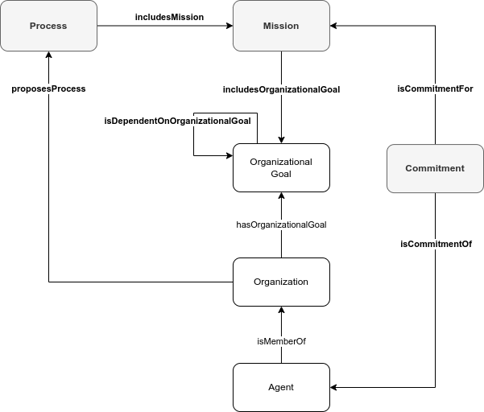

# Coordinate activities within an Organization

## Description

The new FL Logistics enterprise has different main organizational goals that can be pursued in parallel: hire employees, handle invoices, maintain client relationship, and plan and deliver goods. To achieve these goals, the enterprise has defined a set of processes, e.g., **hiring process**, **handling invoice process**, **prospecting client process**, and **delivering goods process**.

The **hiring process**, for instance, has a set of interdependent organizational goals. The **contract signed** organizational goal, that depends on the completion of the **candidate selected** organizational goal, that depends on the completion of both the **recommendations assessed** and **candidates interviewed** organizational goals, that depend on the completion of the **interviewees selected** organizational goal, that depends on the completion of the **job position announced** organizational goal, that finally depends on the completion of the **job position description written** organizational goal. Additionally, the achievement of the **recommendations assessed** organizational goal facilitates the **candidates interviewed** organizational goal and biases the **candidate selected** organizational goal.

The human resources is responsible for achieving the **contract signed**, and **job position announced** organizational goals, while the department director is responsible for the **candidate selected**, **recommendations assessed**, **candidates interviewed**, **interviewees selected**, and **job position description written** organizational goals.

A new person has to be hired in the Commercial department for the Account Manager job position. Frank, the Human Resources Officer, commits to the organizational goals under the human resources responsibilities, while Kate, the Director of the Operations Department, commits to the organizational goals under the department director responsibilities.

## Competency questions

| ID | Question in Natural Language | Example |
|----|------------------------------|---------| 
| q1 | What are the organizational goals and subgoals an agent has to achieve because it commits to the mission Z in the organization X?  | What are the organizational goals and subgoals an agent has to achieve because it commits to the department director mission in the FL Logistics organization? `ex:CandidateSelected`, `ex:CandidatesInterviewed`, `ex:IntervieweesSelected`, `ex:InterviewsConducted`, `ex:InterviewsScheduled`, `ex:JobPositionWritten`, `ex:RecommendationsAssessed` |
| q2 | What are the organizational goals in process Z proposed by the organization X and how these organizational goals are dependent on each other?                                                            | What are the organizational goals in the Account Manager Hiring process proposed by the FL Logistics organization and how these organizational goals are dependent on each other? `ex:CandidateSelected,ex:isBiasedBy,ex:RecommendationsAssessed`, `ex:CandidateSelected,ex:isPrecededBy,ex:CandidatesInterviewed`, `ex:CandidateSelected,ex:isPrecededBy,ex:RecommendationsAssessed`, `ex:CandidatesInterviewed,ex:isFacilitatedBy,ex:RecommendationsAssessed`, `ex:CandidatesInterviewed,ex:isPrecededBy,ex:IntervieweesSelected`, `ex:ContractSigned,ex:isPrecededBy,ex:CandidateSelected`, `ex:IntervieweesSelected,ex:isPrecededBy,ex:JobPositionAnnounced`, `ex:JobPositionAnnounced,ex:isPrecededBy,ex:JobPositionWritten`, `ex:RecommendationsAssessed,ex:isPrecededBy,ex:IntervieweesSelected` |
| q3 | What are the agents responsible for fulfilling the organizational goals of process Y in the organization X?                        | What are the agents responsible for fulfilling the organizational goals of the process of hiring an Account Manager in the FL Logistics organization? `ex:Frank`, `ex:Kate` |

## Glossary



* **Organizational Goal**: see [Create an Organization](https://github.com/HyperAgents/hmas/blob/master/domains/logistics/create-organization/README.md) scenario.
* **Organizational Goal Dependence**: A relation that refers to the way in which two Organizational Goals are related to each other, and one is affected by the other.
* **Mission**: A set of duties that Agents can commit to for achieving Organizational Goals.
* **Process**: A plan specified as a set of Missions to be executed by several coordinating Agents.
* **Commitment**: An engagement of an Agent with the duties of a Mission.
* **Mission Incompatibility**: A relation that imposes a constraint in which the same Agent cannot commit to two missions simultaneously.
* **Mission Constraint**: A relation that refers to a constrain imposed on the Mission, e.g., limiting the number of Agents committing to it.
* **Organization**: see [Discover Organizations, their Members and Materials in Hypermedia Environments](https://github.com/HyperAgents/hmas/blob/master/domains/manufacturing-environments/discover-organization/README.md) scenario.
* **Agent**: see [Discover Organizations, their Members and Materials in Hypermedia Environments](https://github.com/HyperAgents/hmas/blob/master/domains/manufacturing-environments/discover-organization/README.md) scenario.

## Recommendations

* There are different ways of implementing the mechanisms to indicate that an **Organizational Goal** has been achieved: (1) associate a specific [Signifier](https://github.com/HyperAgents/hmas/blob/main/domains/manufacturing-environments/discover-signifiers/README.md) to the Organizational Goal meaning that when the behavior associated to that [Signifier](https://github.com/HyperAgents/hmas/blob/main/domains/manufacturing-environments/discover-signifiers/README.md) is performed, the Organizational Goal is achieved, (2) define a generic Organizational Goal and generic [Signifier](https://github.com/HyperAgents/hmas/blob/main/domains/manufacturing-environments/discover-signifiers/README.md) allowing Agents to identify the association between them and the Organizational Goal achievement.

* The **Mission Incompatibility** and **Mission Constraint** are represented as a SHACL shape instead of an RDF triple. For example, the SHACL shape constraining to 1 the number of Commitments to a Mission is

```
ex:MissionCardinalityShape a sh:NodeShape ;
    sh:targetClass hmas:Mission ;
    sh:property [
        sh:path [ sh:inversePath hmas:isCommitmentFor ] ;
        sh:maxCount 1 ;
        ] .
```
