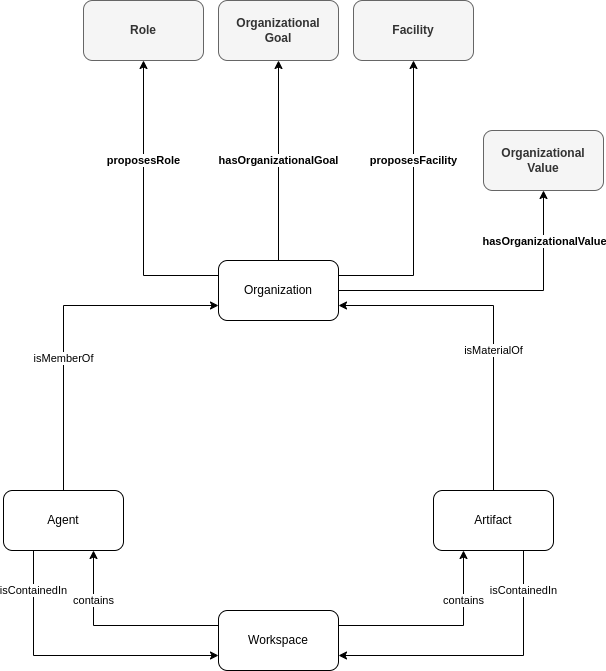

# Create an Organization

## Description
John has experience working in a successful specialized industrial logistics enterprise, the SL Logistics. He sees a business opportunity in providing the same logistics services and wants to create his own enterprise, the FL Logistics. Because of his own experience and the success of the SL Logistics, John intends to use the SL Logistics organization model as reference to organize the FL Logistics.

The FL Logistics enterprise is represented as an organization in the hypermedia environment. Its resource profile is contained in a workspace.

John, however, is unsure whether the SL Logistics' organization model is adequate in his case. Thus, he conducts a comparative analysis between the SL Logistics organization model with other existing organizations with similar organization model as well as with theoretical organization models. He concludes that the SL Logistics' organization model is adequate to create the FL Logistics organization.

The main aspect of the SL Logistics that motivated John to copy its organization model is the enterprise's culture reflected in its organizational values:

* **Organizational Values**
  + _Commitment_: Do everything you can to keep the organization promises to the customers.
  + _Integrity and Respect_: Communicate openly and honestly with the customers and other members of the organization.

The FL Logistics mirrors the composition of the SL Logistics and provides the following roles and responsibilities:
  1. _Human resources officer_: Hire, develop and look after employees.
  2. _Finance officer_: Ensure payable invoices are processed and payed, and receivable invoices payments are received.
  3. _Account manager_: Build and maintain a relationship with customers. Prospect and sell logistic services to industrial enterprises in France.
  4. _Planner_: Plan the optimized delivery schedule according to the customers' requirements and constraints.
  5. _Carrier_: Carry goods between customers and logistics warehouses, or vice-versa.
  6. _Collector_: Collect goods in customers or logistics warehouses according to the plan elaborated by the _Planner_.
  7. _Deliverer_: Deliver goods to customers or logistics warehouses according to the plan elaborated by the _Planner_.
  
The FL Logistics also mirrors the functions of the spacial layout by defining a picking and receiving areas.

## Competency Questions

| ID | Question in Natural Language | Example |
|----|------------------------------|---------|
| q1 | What is the organization X's organization model that can be used to create a new organization?       | What is the SL Logistics' organization model that John can use to create the FL Logistics organization? `ex:Logistics`                             |
| q2 | What are the organizations that follow a different organization model than organization X?           | What are the organizations that follows a different organization model than SL Logistics organization? `ex:HSG_Factory`, `ex:ITM_Factory`          |
| q3 | What are the organizations with the same organization model as the organization X and situated on Y? | What are the organizations with the same organization model as the SL Logistics organization and situated on the same Workspace? `ex:GL_Logistics` |
| q4 | What are the available organization models that can be used to create a new organization?            | What are the available organization models that can be used by John to create the FL Logistics organization? `ex:Logistics`, `ex:Manufacturing`    |
| q5 | What are the organizational values of a given organization?                                          | What are the organizational values of the SL Logistics? `ex:SL_Commitment`, `ex:SL_IntegrityRespect`                                               |
| q6 | What are the elements composing a given organization model?                                          | What are the values of the SL Logistics organization model? `ex:HumanResourcesOfficer`, `ex:FinanceOfficer`, `ex:AccountManager`, `ex:Planner`, `ex:Carrier`, `ex:Collector`, `ex:Deliverer`, `ex:HumanResourcesManagement`, `ex:FinancialManagement`, `ex:CommercialManagement`, `ex:PlanningManagement`, `ex:CarryGoods`, `ex:CollectGoods`, `ex:DeliverGoods`, `ex:PickingArea`, `ex:ReceivingArea`                                                             |
| q7 | What are the roles provided by the organization X?                                                   | What are the roles provided by the SL Logistics organization? `ex:SL_HumanResourcesOfficer`, `ex:SL_FinanceOfficer`, `ex:SL_AccountManager`, `ex:SL_Planner`, `ex:SL_Carrier`, `ex:SL_Collector`, `ex:SL_Deliverer`            |
| q8 | What are the missions proposed by the organization X?                                                | What are the missions proposed by the SL Logistics organization? `ex:SL_HumanResourcesManagement`, `ex:SL_FinancialManagement`, `ex:SL_CommercialManagement`, `ex:SL_PlanningManagement`, `ex:SL_CarryGoods`, `ex:SL_CollectGoods`, `ex:SL_DeliverGoods`                                                   |
| q9 | What are the facilities proposed by the organization X?                                              | What are the facilities proposed by the SL Logistics organization? `ex:SL_PickingArea`, `ex:SL_ReceivingArea`                                      |

## Glossary

* **Organization Model**: An Organization Model is the combination of Roles, Missions, and Facilities in a consistent way used to enact one or multiple Organizations.
* **Organizational Value**: An Organizational Value is a belief about a socially or personally desirable end state or action that is explicitly or implicitly shared by members of an organization.
* **Role**: A Role defines positions of members (i.e., Agents) in an Organization.
* **Mission**: A Mission gathers what Agents have to achieve in an Organization.
* **Facility**: A Facility defines functions of materials (i.e., Artifacts) in an Organization.
* **Organization**: see [Discover Organizations, their Members and Materials in Hypermedia Environments](domains/manufacturing-environments/discover-organization/README.md) scenario.
* **Agent**: see [Discovery of Workspaces, Agents, and Artifacts in Hypermedia Environments](domains/manufacturing-environments/discover-core/README.md) scenario.
* **Artifact**: see [Discovery of Workspaces, Agents, and Artifacts in Hypermedia Environments](domains/manufacturing-environments/discover-core/README.md) scenario.
* **Workspace**: see [Discovery of Workspaces, Agents, and Artifacts in Hypermedia Environments](domains/manufacturing-environments/discover-core/README.md) scenario.

## Recommendations

None
