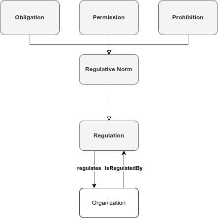

# Regulate an Organization

## Description

The FL Logistics has depots in Lyon and Saint-Étienne. A set of pallets of goods stored in the Lyon depot has to be transferred to the Saint-Étienne depot.

Deliverers are responsible for retrieving, labeling, and loading pallets into trucks. They are allowed to use equipment that lifts and moves pallets to pick up and transport them from the storage area to trucks. They also must label pallets to identify their content.

Marie, a deliverer in the Lyon depot, uses the Forklift 2 to lift down the pallets from shelves and transport them to the delivering area. She then prints the labels describing each pallet contents using the Label Printer 1 and uses the same forklift to load the pallets into a truck.

Carriers are responsible for driving loaded trucks between the Lyon and Saint-Étienne depots. Carriers committed to delivering goods are not allowed to leave a depot with an empty truck.

Jane is a carrier in the FL Logistics.

Collectors are responsible for unloading pallets from trucks, checking, and storing them in the storage area. They are allowed to use equipment that lifts and moves pallets to transport the pallets from the truck to the storage area. He also uses a barcode reader to check the pallet contents.

Once a truck arrives at the Saint-Étienne depot, Leo, a collector at the Saint-Étienne depot, uses the Pallet Jack 3 to unload the pallets from the truck and transport them to the receiving area. Leo then checks the pallet contents against the description on the pallet label using the Barcode Reader 2. Since the pallet contents correspond to the label description, Leo uses the Forklift 3 to transport and lift the pallets up into the shelves in the storage area.

### Regulations

| Id | Modality  | Subject   | Object                             | Context                                        |
|----|-----------|-----------|------------------------------------|----------------------------------------------------------------------|
| R1 | Obliged   | Deliverer | Commitment to DeliverGoods Mission | Deliverer Agent is not committed to any mission and there is no other Agent committed to the DeliverGoods Mission                                |
| R2 | Permitted | Deliverer | Access in PickSetting              | Commitment to DeliverGoods Mission                                   |
| R3 | Obliged   | Carrier   | Commitment to CarryGoods Mission   | Commitment to CarryGoods Mission | Carrier Agent is not committed to any mission and there is no other Agent committed to the CarryGoods Mission |
| R4 | Forbidden | Carrier   | Activity of Carrying               | Commitment to CarryGoods Mission & Empty Truck                       |
| R5 | Obliged   | Collector | Commitment to CollectGoods Mission | Collector Agent is not committed to any mission and there is no other Agent committed to the CollectGoods Mission                                |
| R6 | Permitted | Collector | Access in ReceiveSetting           | Commitment to CollectGoods Mission                                   |

## Competency Questions

| ID | Question in Natural Language | Example |
|----|------------------------------|---------|
| q1 | What are the regulative norms in organization X?                | What are the regulative norms in the FL Logistics organization? `ex:R1`, `ex:R2`, `ex:R3`, `ex:R4`, `ex:R5`, `ex:R6`                            |
| q2 | What are the violated regulative norms in organization X?       | What are the violated regulative norms in the FL Logistics organization? `ex:R2`, `ex:R6`                                                       |
| q3 | Who are the agents doing something permitted in organization X? | Who are the agents doing something permitted in the FL Logistics organization? `ex:Marie`, `ex:Leo`                                             |
| q4 | What are the regulated missions in organization X?              | What are the regulated missions in the FL Logistics organization? `ex:DeliverGoods_Mission`, `ex:CarryGoods_Mission`, `ex:CollectGoods_Mission` |
| q5 | What are the regulated settings in organization X?              | What are the regulated settings in the FL Logistics organization? `ex:PickSetting`, `ex:ReceiveSetting`                                         |

## Glossary

* **Regulation**: A rule, principle, or condition that governs procedure or behavior.
* **Regulative Norm**: A specification of constraints on a behavior and/or a state of affairs that are expected to be regulated in an Organization.
* **Obligation**: A specification of a behavior that an Agent is required to perform or a state of affairs an Agent is required to achieve.
* **Permission**: A specification of a behavior that an Agent is permitted to perform or a state of affairs an Agent is permitted to achieve.
* **Prohibition**: A specification of a behavior that an Agent is forbidden to perform or a state of affairs an Agent is forbidden to achieve.
* **Organization**: see [Discover Organizations, their Members and Materials in Hypermedia Environments](https://github.com/HyperAgents/hmas/blob/main/domains/manufacturing-environments/discover-organization/README.md) scenario.

## Recommendations

* There are different ways to describe **Regulative Norms**. Here we opted for describing **Regulative Norms** using the Shapes Constraint Language ([SHACL](https://www.w3.org/TR/shacl/)).

* In SHACL, the semantics of the NodeShape violation with respect to norms depend on the modality of the norm. The table below illustrates the meaning of the NodeShape violation for the different normative modalities.

| Modality    | SHACL Native        | SPARQLConstraint                | Regulative Norm |
|-------------|---------------------|---------------------------------|-----------------|
| Obligation  | Validation          | Empty (SELECT) / False (ASK)    | Fulfilled       |
| Obligation  | Violation           | Not Empty (SELECT) / True (ASK) | Violated        |
| Prohibition | Validation          | Empty (SELECT) / False (ASK)    | Violated        |
| Prohibition | Violation           | Not Empty (SELECT) / True (ASK) | Fulfilled       |
| Permission  | Validation          | Empty (SELECT) / False (ASK)    | -               |
| Permission  | Violation           | Not Empty (SELECT) / True (ASK) | -               |

* It is also assumed that
  * _Obligation_ describes what must be done
  * _Prohibition_ describes what must not be done
  * _Permission_ describes what can be done

* To verify the **Regulative Norms** R1-R6 specified using SHACL, we created a data file per regulative norm representing a violation to the SHACL specification. We used [Apache Jena v5.4.0](https://jena.apache.org) to check if the SHACL do not validate the content, as expected. The Apache Jena command line syntax used is

`$JENA_HOME/bin/shacl v --shapes=shape.ttl --data=data-[RX].ttl`

where `[RX]` refers to the regulation Id.
