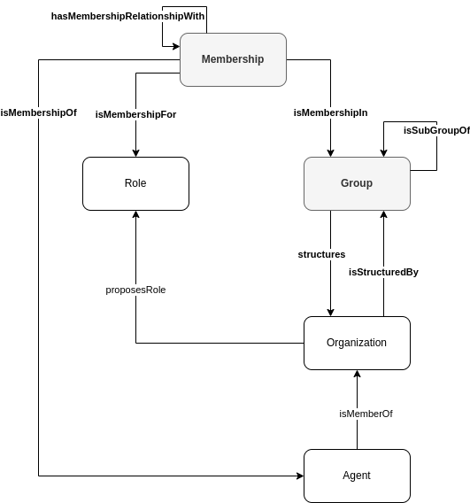

# Structure the Social Context within an Organization

## Description
John had decided to copy the SL Logistics' organization model to create the FL Logistics organization. John structures the FL Logistics into seven departments: Human Resources (HR), Finance, Commercial, Planning, Shipping, Administrative, and Operations. The HR and Finance departments are allocated under the Administrative department, while the Commercial, Planning, and Shipping departments are allocated under the Operations department. The Administrative and Operations departments have a director. The same agent cannot be the director of both departments at the same time.

Associated to each of these departments, the organization defines a set of job positions as follows:
1. Administrative department : _administrative director_
2. Human Resources department : _human resources officer_
3. Finance department : _finance office_
4. Operations department : _operations director_
5. Commercial department : _account manager_
6. Planning department : _planner_
7. Shipping department : _carrier_, _collector_, and _deliverer_

Agents playing certain job positions may be allowed to explicitly interact (e.g., communicate, authority, acquaintance) with agents playing other job positions. For example, the _planner_ in the Planning department has to be able to communicate with the _carrier_, _collector_, and _deliverer_ in the Shipping department since it is envisioned that the former will set the schedule of collects and deliveries for the latter.

Additionally, agents playing the job position of director in the Administrative and Operations department have authority over the agents playing any job position in the departments under their departments.

The FL Logistics advertises available job positions and hires human agents or deploys artificial agents to fulfill them.

The job positions for the HR, Finance, and Commercial departments are required to be performed by human agents since they demand sophisticated interactions with other humans (e.g., customers) involving complex negotiation and creativity skills. The job positions for the Planning and Shipping departments can be played by a mix of humans and artificial agents (e.g., autonomous delivery trucks).

Frank, the _human resources officer_, receives a request to evaluate what are the job positions in the FL Logistics that are not currently being played by anyone. Frank checks the organizational chart and the current list of employees, and concludes that the _account manager_ and _carrier_ job positions are vacant.

Jane, an artificial agent, is deployed as a  _carrier_. Jane can communicate with the _planner_ in the Planning department to know the tasks to perform. Because she was not informed who the _planner_ is, she checks the organizational chart of the enterprise and identifies Igor as the _planner_.

## Competency Questions

| ID | Question in Natural Language | Example |
|----|------------------------------|---------|
| q1 | What are the job positions not being played by anyone in the organization X?                                                                    | What are the job positions not being played by anyone in the FL Logistics organization? `ex:FL_AccountManager`                             |
| q2 | What are the agents to whom agent A can interact with in the organization X?                                                                    | What are the agents to whom Jane can interact with in the FL Logistics organization? `ex:Igor`                                             |
| q3 | What are the memberships not fully populated in the organization X? | What are the memberships not fully populated in the FL Logistics organization? `ex:AccountManager_Commercial_Membership`                   |
| q4 | What are the job positions of agent A in the organization X?        | What are the job positions played by agent Igor in the FL Logistics organization? `ex:FL_Planner`                                          |
| q5 | What are the departments in the organization X                      | What are the departments in the FL Logistics organization? `ex:FL_AdministrativeDepartment`, `ex:FL_CommercialDepartment`, `ex:FL_FinanceDepartment`, `ex:FL_HumanResourcesDepartment`, `ex:FL_OperationsDepartment`, `ex:FL_PlanningDepartment`, `ex:FL_ShippingDepartment`                       |
| q6 | What are the departments under the department Y in the organization X?                                                                          | What are the departments under the Administrative department in the FL Logistics organization? `ex:FL_FinanceDepartment`, `ex:FL_HumanResourcesDepartment`                                                             |
| q7 | What are the memberships incompatibility constraints applied to agents in the organization X?                                                   | What are the memberships incompatibility constraints applied to agents in the FL Logistics organization? `ex:directorIncompatibilityShape` |

## Glossary



* **Membership**: A Membership indicates the Role played by an Agent in a Group of an Organization.
* **Membership Interaction**: A relation that refers to the interaction between Agents member of two Memberships.
* **Memberships Incompatibility**: A relation that imposes a constraint in which the same agent cannot be member of two memberships simultaneously.
* **Group**: A Group structures an Organization.
* **Group Interaction**: A relation that refers to the interaction between Agents member of two Memberships involving two Groups.
* **Sub-Group Relationship**: A relation that refers to a subgroup relationship between two Groups.
* **Organization Model**: see [Create an Organization](https://github.com/HyperAgents/hmas/blob/master/domains/logistics/create-organization/README.md) scenario
* **Role**: see [Create an Organization](https://github.com/HyperAgents/hmas/blob/master/domains/logistics/create-organization/README.md) scenario
* **Organization**: see [Discover Organizations, their Members and Materials in Hypermedia Environments](https://github.com/HyperAgents/hmas/blob/master/domains/manufacturing-environments/discover-organization/README.md) scenario
* **Agent**: see [Discover Organizations, their Members and Materials in Hypermedia Environments](https://github.com/HyperAgents/hmas/blob/master/domains/manufacturing-environments/discover-organization/README.md) scenario

## Recommendations

* The **Membership Interaction** and **Group Interaction** must not be used directly, a sub-property must be created to explicit the exact type of interaction being represented between memberships and groups respectively.

* The **Memberships Incompatibility** is represented as a SHACL shape instead of an RDF triple. For example, the SHACL shape constraining the same agent to be the director of two departments at the same time is

    ```
    ex:
        sh:declare [
            sh:prefix "ex" ;
            sh:namespace "http://example.org/" ;
            ] .
    hmas:
        sh:declare [
            sh:prefix "hmas" ;
            sh:namespace "https://purl.org/hmas/" ;
            ] .
    rdfs:
        sh:declare [
            sh:prefix "rdfs" ;
            sh:namespace "http://www.w3.org/2000/01/rdf-schema#" ;
            ] .

    ex:directorIncompatibilityShape a sh:NodeShape ;
        sh:targetClass hmas:Agent ;
        sh:sparql [
            a sh:SPARQLConstraint ;
            sh:message "The same agent cannot play the Director role in two different memberships simultaneously." ;
            sh:prefixes ex:, hmas:, rdfs: ;
            sh:select """
                SELECT (?agent as $this) (COUNT(?s) as ?c)
                WHERE {
                    ?s hmas:isMembershipOf ?agent .
                    ?s hmas:isMembershipFor ?role .
                    ?role a ex:Director .
                }
                GROUP BY ?agent ?role
                HAVING (COUNT(?s) > 1)
			    """ ;
            ] .
    ```
    
    The association of the constraints applied to the memberships of an organization is done by adding a SHACL property in the organization model. For example, add the following SHACL property into the `ex:Logistics` organization model to associate it with the `ex:directorIncompatibilityShape`
    
    ```
    ex:Logistics a sh:NodeShape ;
        rdfs:subClassOf hmas:Organization ;
        
        sh:property [
            sh:path [ sh:inversePath hmas:isMemberOf ] ;
            sh:node ex:directorIncompatibilityShape ;
            ] .
    ```
