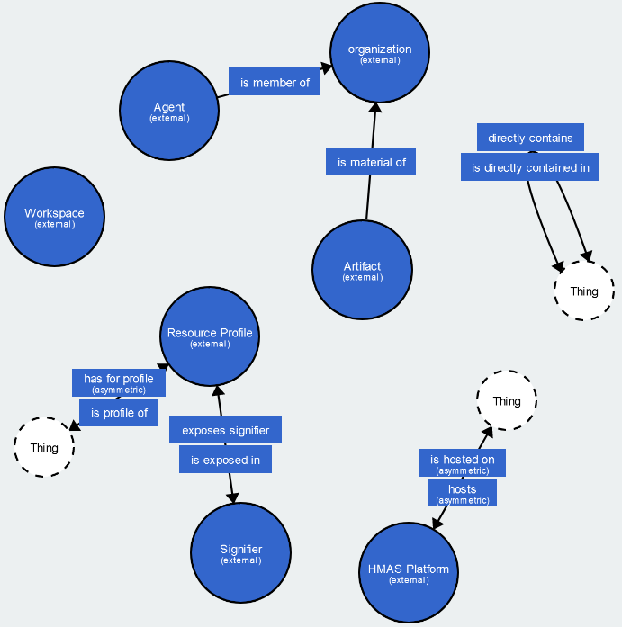

# hMAS Ontology Primer

# Abstract

This document is an introduction to the hMAS ontology, which defines a vocabulary for describing Hypermedia Multi-Agent Systems (hMAS). This ontology aims to align with the latest W3C recommendations and, at the same time, fit the different approaches for engineering multi-agent systems — so that it can serve as a conceptual "narrow waist" for Web-based MAS.

This documents provides an overview of the key concepts of the hMAS ontology as well as examples for their usage and implementation.

# Table of contents

1. [Introduction](#1-introduction)
2. [Overview of HMAS](#2-overview-of-hmas) 
    2.1. [Agent](#21-agent) 
    2.2. [Artifact](#22-artifact) 
    2.3. [Resource Profile](#23-resource-profile) 
    2.4. [Signifier](#24-signifier) 
    2.5. [Workspace](#25-workspace) 
    2.6. [Organization](#26-organization) 
    2.7. [Platform](#27-platform) 
3. [Examples of key concepts of HMAS](#3-examples-of-key-concepts-of-hmas) 
    3.1. [Agent](#31-agent) 
    3.2. [Artifact](#31-agent) 
    3.3. [Resource Profile](#33-resource-profile) 
    3.4. [Signifier](#34-signifier) 
    3.5. [Workspace](#35-workspace) 
    3.6. [Organization](#36-organization) 
    3.7. [Platform](#37-platform) 
4. [Summary](#4-summary)
5. [Acknowledgements](#5-acknowledgements)
6. [References](#6-references)

# 1. Introduction

This document is an introduction to the *Hypermedia Multi-Agents Systems* (HMAS) ontology that is meant for describing a Multi Agents System with agents exploring a Web environment.

A Multi Agents System (MAS) is a system composed of several entities with autonomous behaviors in an environment performing tasks while following some organization. This definition brings 3 aspects what this ontology abroaches:

- agents: how to represent the knowledge base and the goals of the agents?
- environment: how to represent the objects, their usages, and the environment itself where these objects can be found?
- organization: how to represent the different roles, rules, and missions that must be given to agents?

The modern Web relies on the Hypermedia mechanisms in order to interact with the resources that can be found there, in a way that the user is agnostic from its implementation details. That is why we consider here the web as a *Hypermedia* environment.

This ontology is meant to be able to describe a MAS that is not necessarily embodied, and also where agents can be softwares as well as human beings. A social network with humans posting content in interaction with software agents browsing the platform for moderation is a good example of what this ontology can describe.

The later sections of this document should provide you:

- high-level definitions of the key concepts of the HMAS ontology
- simple scenarii for each of these concepts and their implementations both in [TURTLE] format and in RDF/XML

Finally this document ends with a summary of the features available in HMAS 

# 2. Overview of HMAS

This session is meant to explain the key classes of the HMAS ontology. We will go further into detail for each of them. Here is an overview of the structure of the main HMAS model.

The terms of this vocabulary are stored in different modules, namely:

- core: Provides the main concepts for providing a Hypermedia MAS platform
- interaction: Provides the needed terms to describe the interactions that an agents has with its environment
- regulation: Provides the needed terms to describe a MAS as an organizational structure with rules, roles and missions

## 2.1. Agent

An agent is an entity capable of autonomous behavior. It can be a human being or a software and the MAS is agnostic of that. An agent should join an organization, adopt a role and perform missions that it is given. In order to achieve its missions, the agent can interact with the environment where it is.

## 2.2. Artifact

A resource that can be dynamically constructed, shared, and used by agents to support their activities. In a Hypermedia MAS, an artifact exposes and can be accessed through a hypermedia interface (in addition to other possible interfaces, such as a physical interface). An artifact can have many forms as:

- a resource that the agent can find in the environment (an API, a database, a file, …)
- an artifact meant to represent a part of the environment that can be joined or left
- an artifact made to use several other artifacts at the same time
- an organizational artifact meant to share data among agents about missions and roles
- a communication artifact that can be used by agents to interact with other agents
- etc…

The artifacts can have different lifetimes:

- some of them can be static environment parts of the MAS
- some of them can be dynamically created or deleted on the fly

An artifact has features, named *Signifiers*, that are available for use by the agents the way they intend to use it. For a given artifact, a summary of all its available signifiers can be found in its *Resource Profile*

## 2.3. Resource Profile

A resource profile is structured data describing a resource through general metadata, domain- and application-specific metadata, and signifiers. Any artifact has its own Resource Profile. This allows an agent to discover the features of an artifact at runtime. This concepts comes directly from the Web of Things.

**Example:** A robotic arm is an artifact and its resource profile explains that there is an endpoint that allows to set the position of this arm.

## 2.4. Signifier

A signifier is a perceivable sign/cue that can be interpreted meaningfully by an agent to reveal information about a behavior possibility. Please note that a signifier does not explain what to use the artifact for, but what can be used from the artifact instead.

A signifier should always give the minimal constraints that are expected to the input data as well as the minimal constraints that you should expect from the output data.

**Example**: The robotic arm can be moved in order to move objects from a truck into a box, but it can also be used to hammer nails. The signifier itself only states that the arm can be moved, describing the constraints of what is expected as input, and the constraints of what is going to be returned to the agent.

## 2.5. Workspace

A logical container for any resource in general and in particular for agents, artifacts or other workspaces. Workspaces can be created or deleted by agents on a needed basis. All agent interactions happen in the context of a workspace whether or not the worspace was explicitly reified. A workspace can be, for instance, implemented on top of an LDP (Linked Data Platform) indirect container.

Therefore a workspace can:

- represent a bounded space of the environment and therefore remain static
- be created and deleted at runtime in order to create a temporary common space between agents from several organizations

## 2.6. Organization

An Organization is an entity situated on Agents and Artifacts, and regulated by a regulation system. It should regulate the following aspects:

- which values drive the organization?
- what are the groups structuring the organization?
- what are the roles of the agents within the organization?
- which missions should the agent perform?
- what are each artifact meant for in this organization?

## 2.7. Platform

A Hypermedia MAS (HMAS) platform is a system providing a collection of features to support Hypermedia MAS. Common features include support for communication and interaction, runtime environments for agents, artifacts, or organizations, etc.

This ontology is agnostic of the implementation details so even if support has been made for JaCaMo, it can be possibly any system.

# 3. Examples of key concepts of HMAS

Now that we have an overview of the main classes available in HMAS, this section should provide for each of them a small scenario as well as an implementation of that scenario. Each implementation will be provided both in turtle format and in RDF/XML.

## 3.1. Agent

Here we simply want the software HyperReader2000, to be agent on our platform platf, in the workspace forumPlatf

Turtle Example

<pre lang="Turtle"><code>
@prefix hmas: &#60;https://purl.org/hmas/> .
@prefix platf: &#60;http://www.example.org/platforms/platf#> .
@prefix forumPlatf: &#60;http://www.example.org/workspaces/forumPlatf#> .
@prefix HyperReader2000: &#60;http://www.example.org/agents/HyperReader2000#> .
 &#10;
HyperReader2000:agent a hmas:Agent ;
&nbsp;&nbsp;hmas:isHostedOn platf:platform ;
&nbsp;&nbsp;hmas:isContainedIn forumPlatf:workspace ;
&nbsp;&nbsp;hmas:hasProfile HyperReader2000: .
</code></pre>

XML Example

<pre lang="xml"><code>
&#60;?xml version="1.0" encoding="utf-8" ?>
&#60;rdf:RDF xmlns:rdf="http://www.w3.org/1999/02/22-rdf-syntax-ns#"
         xmlns:hmas="https://purl.org/hmas/">
  &#60;rdf:Description rdf:about="http://www.example.org/agents/HyperReader2000#agent">
    &#60;rdf:type rdf:resource="https://purl.org/hmas/Agent"/>
    &#60;hmas:isHostedOn rdf:resource="http://www.example.org/platforms/platf#platform"/>
    &#60;hmas:isContainedIn rdf:resource="http://www.example.org/workspaces/forumPlatf#workspace"/>
    &#60;hmas:hasProfile rdf:resource="http://www.example.org/agents/HyperReader2000#"/>
  &#60;/rdf:Description>
&#60;/rdf:RDF>
</code></pre>

## 3.2. Artifact

Here we want an artifact named forumAccount contained in the workspace forumPlatf

Turtle Example

<pre lang="Turtle"><code>
@prefix hmas: &#60;https://purl.org/hmas/> .
@prefix platf: &#60;http://www.example.org/platforms/platf#> .
@prefix forumPlatf: &#60;http://www.example.org/artifacts/forumAccount#> .
@prefix forumAccount: &#60;https://www.example.org/forumAccount/> .
 &#10;
forumAccount:artifact a hmas:Artifact ;
&nbsp;&nbsp;hmas:hasProfile forumAccount: ;
&nbsp;&nbsp;hmas:isHostedOn platf:platform ;
&nbsp;&nbsp;hmas:isContainedIn forumPlatf:workspace .
</code></pre>

XML Example

<pre lang="xml"><code>
&#60;?xml version="1.0" encoding="utf-8" ?>
&#60;rdf:RDF xmlns:rdf="http://www.w3.org/1999/02/22-rdf-syntax-ns#"
         xmlns:hmas="https://purl.org/hmas/">

&nbsp;&nbsp;&#60;rdf:Description rdf:about="http://www.example.org/artifacts/forumAccount#artifact">
&nbsp;&nbsp;&nbsp;&nbsp;&#60;rdf:type rdf:resource="https://purl.org/hmas/Artifact"/>
&nbsp;&nbsp;&nbsp;&nbsp;&#60;hmas:isHostedOn rdf:resource="http://www.example.org/platforms/platf#platform"/>
&nbsp;&nbsp;&nbsp;&nbsp;&#60;hmas:isContainedIn rdf:resource="http://www.example.org/workspaces/forumPlatf#workspace"/>
&nbsp;&nbsp;&nbsp;&nbsp;&#60;hmas:hasProfile rdf:resource="http://www.example.org/artifacts/forumAccount#"/
&nbsp;&nbsp;&#60;/rdf:Description>
&#60;/rdf:RDF>
</code></pre>

## 3.3. Resource Profile

Our artifact ForumAccount should have a Resource Profile exposing one signifier for getting a post from the forum. The signifier should be defined later.

Turtle Example

<pre lang="Turtle"><code>
@prefix hmas: &#60;https://purl.org/hmas/> .
@prefix shape: &#60;http://www.example.org/shapes/> .
@prefix sh: &#60;http://www.w3.org/ns/shacl#> .
@prefix hctl: &#60;https://www.w3.org/2019/wot/hypermedia#> .
@prefix htv: &#60;http://www.w3.org/2011/http#> .
@prefix dcterms: &#60;http://purl.org/dc/> .
@prefix xsd: &#60;http://www.w3.org/2001/XMLSchema#> .
@prefix prov: &#60;http://www.w3.org/ns/prov#> .
@prefix sign: &#60;http://www.example.org/signifiers/> .

forumAccount: a hmas:ResourceProfile ;
&#35;not mandatory since we defined the hmas:hasProfile of the artifact earlier
&nbsp;&nbsp;hmas:isProfileOf forumAccount:artifact ;
&nbsp;&nbsp;hmas:exposesSignifier sign:getPost .
</code></pre>

XML Example

<pre lang="xml"><code>
&#60;?xml version="1.0" encoding="utf-8" ?>
&#60;rdf:RDF xmlns:rdf="http://www.w3.org/1999/02/22-rdf-syntax-ns#"
         xmlns:hmas="https://purl.org/hmas/">

&nbsp;&nbsp;&#60;rdf:Description rdf:about="http://www.example.org/artifacts/forumAccount#">
&nbsp;&nbsp;&nbsp;&nbsp;&#60;rdf:type rdf:resource="https://purl.org/hmas/ResourceProfile"/>
&nbsp;&nbsp;&nbsp;&nbsp;&#60;hmas:isProfileOf rdf:resource="http://www.example.org/artifacts/forumAccount#artifact"/>
&nbsp;&nbsp;&nbsp;&nbsp;&#60;hmas:exposesSignifier rdf:resource="http://www.example.org/signifiers/getPost"/>
&nbsp;&nbsp;&nbsp;&nbsp;&#60;hmas:exposesSignifier rdf:resource="http://www.example.org/signifiers/moderatePost"/>
&nbsp;&nbsp;&#60;/rdf:Description>
&#60;/rdf:RDF>
</code></pre>

## 3.4. Signifier

In this part we will implement the signifiers themselves for the same artifact than in the previous section.

Turtle Example

<pre lang="Turtle"><code>
@prefix shape: &#60;http://www.example.org/shapes/> .
@prefix sh: &#60;http://www.w3.org/ns/shacl#> .
@prefix hctl: &#60;https://www.w3.org/2019/wot/hypermedia#> .
@prefix htv: &#60;http://www.w3.org/2011/http#> .
@prefix dcterms: &#60;http://purl.org/dc/> .
@prefix xsd: &#60;http://www.w3.org/2001/XMLSchema#> .
@prefix prov: &#60;http://www.w3.org/ns/prov#> .

&#35; Defining the signifier itself

sign:getPost a hmas:Signifier ;
&nbsp;&nbsp;hmas:signifies shape:getPost .

&#35; Defining the form of the input

shape:getPostForm a sh:NodeShape ;
&nbsp;&nbsp;sh:class hctl:Form ;
&nbsp;&nbsp;sh:property [
&nbsp;&nbsp;&nbsp;&nbsp;sh:path hctl:forContentType ;
&nbsp;&nbsp;&nbsp;&nbsp;sh:minCount 1 ;
&nbsp;&nbsp;&nbsp;&nbsp;sh:maxCount 1 ;
&nbsp;&nbsp;&nbsp;&nbsp;sh:hasValue "application/json"
&nbsp;&nbsp;] , [
&nbsp;&nbsp;&nbsp;&nbsp;sh:path htv:methodName ;
&nbsp;&nbsp;&nbsp;&nbsp;sh:minCount 1 ;
&nbsp;&nbsp;&nbsp;&nbsp;sh:maxCount 1 ;
&nbsp;&nbsp;&nbsp;&nbsp;sh:hasValue "POST"
&nbsp;&nbsp;] , [
&nbsp;&nbsp;&nbsp;&nbsp;sh:path hctl:hasTarget ;
&nbsp;&nbsp;&nbsp;&nbsp;sh:minCount 1 ;
&nbsp;&nbsp;&nbsp;&nbsp;sh:maxCount 1 ;
&nbsp;&nbsp;&nbsp;&nbsp;sh:hasValue &#60;http://www.example.org/api/getPost>
&nbsp;&nbsp;] .

&#35; Defining the form of the output

shape:getPostOutput a sh:NodeShape ;
&nbsp;&nbsp;sh:class shape:postSchema ;
&nbsp;&nbsp;sh:property [
&nbsp;&nbsp;&nbsp;&nbsp;sh:path dcterms:identifier ;
&nbsp;&nbsp;&nbsp;&nbsp;sh:minCount 1 ;
&nbsp;&nbsp;&nbsp;&nbsp;sh:maxCount 1 ;
&nbsp;&nbsp;&nbsp;&nbsp;sh:datatype xsd:int ;
&nbsp;&nbsp;&nbsp;&nbsp;sh:minExclusive 0 ;
&nbsp;&nbsp;&nbsp;&nbsp;sh:maxExclusive 10000
&nbsp;&nbsp;] , [
&nbsp;&nbsp;&nbsp;&nbsp;sh:path dcterms:description ;
&nbsp;&nbsp;&nbsp;&nbsp;sh:minCount 1 ;
&nbsp;&nbsp;&nbsp;&nbsp;sh:maxCount 1 ;
&nbsp;&nbsp;&nbsp;&nbsp;sh:datatype: xsd:string
&nbsp;&nbsp;] .

&#35; Defining the whole signifier shape

shape:getPost a sh:NodeShape ;
&nbsp;&nbsp;sh:class hmas:ActionExecution ;
&nbsp;&nbsp;sh:property [
&nbsp;&nbsp;&nbsp;&nbsp;sh:path prov:used ;
&nbsp;&nbsp;&nbsp;&nbsp;sh:minQualifiedShape 1 ;
&nbsp;&nbsp;&nbsp;&nbsp;sh:maxQualifiedShape 1 ;
&nbsp;&nbsp;&nbsp;&nbsp;sh:qualifiedValueShape shape:getPostForm
&nbsp;&nbsp;] , [
&nbsp;&nbsp;&nbsp;&nbsp;sh:path hmas:hasInput ;
&nbsp;&nbsp;&nbsp;&nbsp;sh:minCount 1 ;
&nbsp;&nbsp;&nbsp;&nbsp;sh:maxCount 1 ;
&nbsp;&nbsp;&nbsp;&nbsp;sh:datatype 0 ;
&nbsp;&nbsp;&nbsp;&nbsp;sh:minExclusive 0 ;
&nbsp;&nbsp;&nbsp;&nbsp;sh:maxExclusive 10000
&nbsp;&nbsp;] , [
&nbsp;&nbsp;&nbsp;&nbsp;sh:path hmas:hasOutput ;
&nbsp;&nbsp;&nbsp;&nbsp;sh:minQualifiedShape 1 ;
&nbsp;&nbsp;&nbsp;&nbsp;sh:maxQualifiedShape 1 ;
&nbsp;&nbsp;&nbsp;&nbsp;sh:qualifiedValueShape shape:getPostOutput
&nbsp;&nbsp;] .
</code></pre>

XML Example

<pre lang="xml"><code>
&#60;?xml version="1.0" encoding="utf-8" ?>
&#60;rdf:RDF xmlns:rdf="http://www.w3.org/1999/02/22-rdf-syntax-ns#"
         xmlns:hmas="https://purl.org/hmas/"
         xmlns:sh="http://www.w3.org/ns/shacl#">

&nbsp;&nbsp;&#60;rdf:Description rdf:about="http://www.example.org/signifiers/getPost">
&nbsp;&nbsp;&nbsp;&nbsp;&#60;rdf:type rdf:resource="https://purl.org/hmas/Signifier"/>
&nbsp;&nbsp;&nbsp;&nbsp;&#60;hmas:signifies>
&nbsp;&nbsp;&nbsp;&nbsp;&nbsp;&nbsp;&#60;rdf:Description rdf:about="http://www.example.org/shapes/getPost">
&nbsp;&nbsp;&nbsp;&nbsp;&nbsp;&nbsp;&nbsp;&nbsp;&#60;rdf:type rdf:resource="http://www.w3.org/ns/shacl#NodeShape"/>
&nbsp;&nbsp;&nbsp;&nbsp;&nbsp;&nbsp;&nbsp;&nbsp;&#60;sh:class rdf:resource="https://purl.org/hmas/ActionExecution"/>
&nbsp;&nbsp;&nbsp;&nbsp;&nbsp;&nbsp;&nbsp;&nbsp;&#60;sh:property>
&nbsp;&nbsp;&nbsp;&nbsp;&nbsp;&nbsp;&nbsp;&nbsp;&nbsp;&nbsp;&#60;rdf:Description>
&nbsp;&nbsp;&nbsp;&nbsp;&nbsp;&nbsp;&nbsp;&nbsp;&nbsp;&nbsp;&nbsp;&nbsp;&#60;sh:path rdf:resource="http://www.w3.org/ns/prov#used"/>
&nbsp;&nbsp;&nbsp;&nbsp;&nbsp;&nbsp;&nbsp;&nbsp;&nbsp;&nbsp;&nbsp;&nbsp;&#60;sh:minQualifiedShape rdf:datatype="http://www.w3.org/2001/XMLSchema#integer">1 &#60;/sh:minQualifiedShape>
&nbsp;&nbsp;&nbsp;&nbsp;&nbsp;&nbsp;&nbsp;&nbsp;&nbsp;&nbsp;&nbsp;&nbsp;&#60;sh:maxQualifiedShape rdf:datatype="http://www.w3.org/2001/XMLSchema#integer">1 &#60;/sh:maxQualifiedShape>
&nbsp;&nbsp;&nbsp;&nbsp;&nbsp;&nbsp;&nbsp;&nbsp;&nbsp;&nbsp;&nbsp;&nbsp;&#60;sh:qualifiedValueShape>
&nbsp;&nbsp;&nbsp;&nbsp;&nbsp;&nbsp;&nbsp;&nbsp;&nbsp;&nbsp;&nbsp;&nbsp;&nbsp;&nbsp;&#60;sh:NodeShape rdf:about="http://www.example.org/shapes/getPostForm">
&nbsp;&nbsp;&nbsp;&nbsp;&nbsp;&nbsp;&nbsp;&nbsp;&nbsp;&nbsp;&nbsp;&nbsp;&nbsp;&nbsp;&nbsp;&nbsp;&#60;sh:class rdf:resource="https://www.w3.org/2019/wot/hypermedia#Form"/>
&nbsp;&nbsp;&nbsp;&nbsp;&nbsp;&nbsp;&nbsp;&nbsp;&nbsp;&nbsp;&nbsp;&nbsp;&nbsp;&nbsp;&nbsp;&nbsp;&#60;sh:property>
&nbsp;&nbsp;&nbsp;&nbsp;&nbsp;&nbsp;&nbsp;&nbsp;&nbsp;&nbsp;&nbsp;&nbsp;&nbsp;&nbsp;&nbsp;&nbsp;&nbsp;&nbsp;&#60;rdf:Description>
&nbsp;&nbsp;&nbsp;&nbsp;&nbsp;&nbsp;&nbsp;&nbsp;&nbsp;&nbsp;&nbsp;&nbsp;&nbsp;&nbsp;&nbsp;&nbsp;&nbsp;&nbsp;&nbsp;&nbsp;&#60;sh:path rdf:resource="https://www.w3.org/2019/wot/hypermedia#forContentType"/>
&nbsp;&nbsp;&nbsp;&nbsp;&nbsp;&nbsp;&nbsp;&nbsp;&nbsp;&nbsp;&nbsp;&nbsp;&nbsp;&nbsp;&nbsp;&nbsp;&nbsp;&nbsp;&nbsp;&nbsp;&#60;sh:minCount rdf:datatype="http://www.w3.org/2001/XMLSchema#integer">1 &#60;/sh:minCount>
&nbsp;&nbsp;&nbsp;&nbsp;&nbsp;&nbsp;&nbsp;&nbsp;&nbsp;&nbsp;&nbsp;&nbsp;&nbsp;&nbsp;&nbsp;&nbsp;&nbsp;&nbsp;&nbsp;&nbsp;&#60;sh:maxCount rdf:datatype="http://www.w3.org/2001/XMLSchema#integer">1 &#60;/sh:maxCount>
&nbsp;&nbsp;&nbsp;&nbsp;&nbsp;&nbsp;&nbsp;&nbsp;&nbsp;&nbsp;&nbsp;&nbsp;&nbsp;&nbsp;&nbsp;&nbsp;&nbsp;&nbsp;&nbsp;&nbsp;&#60;sh:hasValue>application/json&#60;/sh:hasValue>
&nbsp;&nbsp;&nbsp;&nbsp;&nbsp;&nbsp;&nbsp;&nbsp;&nbsp;&nbsp;&nbsp;&nbsp;&nbsp;&nbsp;&nbsp;&nbsp;&nbsp;&nbsp;&#60;/rdf:Description>
&nbsp;&nbsp;&nbsp;&nbsp;&nbsp;&nbsp;&nbsp;&nbsp;&nbsp;&nbsp;&nbsp;&nbsp;&nbsp;&nbsp;&nbsp;&nbsp;&#60;/sh:property>
&nbsp;&nbsp;&nbsp;&nbsp;&nbsp;&nbsp;&nbsp;&nbsp;&nbsp;&nbsp;&nbsp;&nbsp;&nbsp;&nbsp;&nbsp;&nbsp;&#60;sh:property>
&nbsp;&nbsp;&nbsp;&nbsp;&nbsp;&nbsp;&nbsp;&nbsp;&nbsp;&nbsp;&nbsp;&nbsp;&nbsp;&nbsp;&nbsp;&nbsp;&nbsp;&nbsp;&#60;rdf:Description>
&nbsp;&nbsp;&nbsp;&nbsp;&nbsp;&nbsp;&nbsp;&nbsp;&nbsp;&nbsp;&nbsp;&nbsp;&nbsp;&nbsp;&nbsp;&nbsp;&nbsp;&nbsp;&nbsp;&nbsp;&#60;sh:path rdf:resource="http://www.w3.org/2011/http#methodName"/>
&nbsp;&nbsp;&nbsp;&nbsp;&nbsp;&nbsp;&nbsp;&nbsp;&nbsp;&nbsp;&nbsp;&nbsp;&nbsp;&nbsp;&nbsp;&nbsp;&nbsp;&nbsp;&nbsp;&nbsp;&#60;sh:minCount rdf:datatype="http://www.w3.org/2001/XMLSchema#integer">1 &#60;/sh:minCount>
&nbsp;&nbsp;&nbsp;&nbsp;&nbsp;&nbsp;&nbsp;&nbsp;&nbsp;&nbsp;&nbsp;&nbsp;&nbsp;&nbsp;&nbsp;&nbsp;&nbsp;&nbsp;&nbsp;&nbsp;&#60;sh:maxCount rdf:datatype="http://www.w3.org/2001/XMLSchema#integer">1 &#60;/sh:maxCount>
&nbsp;&nbsp;&nbsp;&nbsp;&nbsp;&nbsp;&nbsp;&nbsp;&nbsp;&nbsp;&nbsp;&nbsp;&nbsp;&nbsp;&nbsp;&nbsp;&nbsp;&nbsp;&nbsp;&nbsp;&#60;sh:hasValue>POST&#60;/sh:hasValue>
&nbsp;&nbsp;&nbsp;&nbsp;&nbsp;&nbsp;&nbsp;&nbsp;&nbsp;&nbsp;&nbsp;&nbsp;&nbsp;&nbsp;&nbsp;&nbsp;&nbsp;&nbsp;&#60;/rdf:Description>
&nbsp;&nbsp;&nbsp;&nbsp;&nbsp;&nbsp;&nbsp;&nbsp;&nbsp;&nbsp;&nbsp;&nbsp;&nbsp;&nbsp;&nbsp;&nbsp;&#60;/sh:property>
&nbsp;&nbsp;&nbsp;&nbsp;&nbsp;&nbsp;&nbsp;&nbsp;&nbsp;&nbsp;&nbsp;&nbsp;&nbsp;&nbsp;&nbsp;&nbsp;&#60;sh:property>
&nbsp;&nbsp;&nbsp;&nbsp;&nbsp;&nbsp;&nbsp;&nbsp;&nbsp;&nbsp;&nbsp;&nbsp;&nbsp;&nbsp;&nbsp;&nbsp;&nbsp;&nbsp;&#60;rdf:Description>
&nbsp;&nbsp;&nbsp;&nbsp;&nbsp;&nbsp;&nbsp;&nbsp;&nbsp;&nbsp;&nbsp;&nbsp;&nbsp;&nbsp;&nbsp;&nbsp;&nbsp;&nbsp;&nbsp;&nbsp;&#60;sh:path rdf:resource="https://www.w3.org/2019/wot/hypermedia#hasTarget"/>
&nbsp;&nbsp;&nbsp;&nbsp;&nbsp;&nbsp;&nbsp;&nbsp;&nbsp;&nbsp;&nbsp;&nbsp;&nbsp;&nbsp;&nbsp;&nbsp;&nbsp;&nbsp;&nbsp;&nbsp;&#60;sh:minCount rdf:datatype="http://www.w3.org/2001/XMLSchema#integer">1 &#60;/sh:minCount>
&nbsp;&nbsp;&nbsp;&nbsp;&nbsp;&nbsp;&nbsp;&nbsp;&nbsp;&nbsp;&nbsp;&nbsp;&nbsp;&nbsp;&nbsp;&nbsp;&nbsp;&nbsp;&nbsp;&nbsp;&#60;sh:maxCount rdf:datatype="http://www.w3.org/2001/XMLSchema#integer">1 &#60;/sh:maxCount>
&nbsp;&nbsp;&nbsp;&nbsp;&nbsp;&nbsp;&nbsp;&nbsp;&nbsp;&nbsp;&nbsp;&nbsp;&nbsp;&nbsp;&nbsp;&nbsp;&nbsp;&nbsp;&nbsp;&nbsp;&#60;sh:hasValue rdf:resource="http://www.example.org/api/getPost"/>
&nbsp;&nbsp;&nbsp;&nbsp;&nbsp;&nbsp;&nbsp;&nbsp;&nbsp;&nbsp;&nbsp;&nbsp;&nbsp;&nbsp;&nbsp;&nbsp;&nbsp;&nbsp;&#60;/rdf:Description>
&nbsp;&nbsp;&nbsp;&nbsp;&nbsp;&nbsp;&nbsp;&nbsp;&nbsp;&nbsp;&nbsp;&nbsp;&nbsp;&nbsp;&nbsp;&nbsp;&#60;/sh:property>
&nbsp;&nbsp;&nbsp;&nbsp;&nbsp;&nbsp;&nbsp;&nbsp;&nbsp;&nbsp;&nbsp;&nbsp;&nbsp;&nbsp;&#60;/sh:NodeShape>
&nbsp;&nbsp;&nbsp;&nbsp;&nbsp;&nbsp;&nbsp;&nbsp;&nbsp;&nbsp;&nbsp;&nbsp;&#60;/sh:qualifiedValueShape>
&nbsp;&nbsp;&nbsp;&nbsp;&nbsp;&nbsp;&nbsp;&nbsp;&nbsp;&nbsp;&#60;/rdf:Description>
&nbsp;&nbsp;&nbsp;&nbsp;&nbsp;&nbsp;&nbsp;&nbsp;&#60;/sh:property>
&nbsp;&nbsp;&nbsp;&nbsp;&nbsp;&nbsp;&nbsp;&nbsp;&#60;sh:property>
&nbsp;&nbsp;&nbsp;&nbsp;&nbsp;&nbsp;&nbsp;&nbsp;&nbsp;&nbsp;&#60;rdf:Description>
&nbsp;&nbsp;&nbsp;&nbsp;&nbsp;&nbsp;&nbsp;&nbsp;&nbsp;&nbsp;&nbsp;&nbsp;&#60;sh:path rdf:resource="https://purl.org/hmas/hasInput"/>
&nbsp;&nbsp;&nbsp;&nbsp;&nbsp;&nbsp;&nbsp;&nbsp;&nbsp;&nbsp;&nbsp;&nbsp;&#60;sh:minCount rdf:datatype="http://www.w3.org/2001/XMLSchema#integer">1 &#60;/sh:minCount>
&nbsp;&nbsp;&nbsp;&nbsp;&nbsp;&nbsp;&nbsp;&nbsp;&nbsp;&nbsp;&nbsp;&nbsp;&#60;sh:maxCount rdf:datatype="http://www.w3.org/2001/XMLSchema#integer">1 &#60;/sh:maxCount>
&nbsp;&nbsp;&nbsp;&nbsp;&nbsp;&nbsp;&nbsp;&nbsp;&nbsp;&nbsp;&nbsp;&nbsp;&#60;sh:datatype rdf:datatype="http://www.w3.org/2001/XMLSchema#integer">0 &#60;/sh:datatype>
&nbsp;&nbsp;&nbsp;&nbsp;&nbsp;&nbsp;&nbsp;&nbsp;&nbsp;&nbsp;&nbsp;&nbsp;&#60;sh:minExclusive rdf:datatype="http://www.w3.org/2001/XMLSchema#integer">0 &#60;/sh:minExclusive>
&nbsp;&nbsp;&nbsp;&nbsp;&nbsp;&nbsp;&nbsp;&nbsp;&nbsp;&nbsp;&nbsp;&nbsp;&#60;sh:maxExclusive rdf:datatype="http://www.w3.org/2001/XMLSchema#integer">10000 &#60;/sh:maxExclusive>
&nbsp;&nbsp;&nbsp;&nbsp;&nbsp;&nbsp;&nbsp;&nbsp;&nbsp;&nbsp;&#60;/rdf:Description>
&nbsp;&nbsp;&nbsp;&nbsp;&nbsp;&nbsp;&nbsp;&nbsp;&#60;/sh:property>
&nbsp;&nbsp;&nbsp;&nbsp;&nbsp;&nbsp;&nbsp;&nbsp;&#60;sh:property>
&nbsp;&nbsp;&nbsp;&nbsp;&nbsp;&nbsp;&nbsp;&nbsp;&nbsp;&nbsp;&#60;rdf:Description>
&nbsp;&nbsp;&nbsp;&nbsp;&nbsp;&nbsp;&nbsp;&nbsp;&nbsp;&nbsp;&nbsp;&nbsp;&#60;sh:path rdf:resource="https://purl.org/hmas/hasOutput"/>
&nbsp;&nbsp;&nbsp;&nbsp;&nbsp;&nbsp;&nbsp;&nbsp;&nbsp;&nbsp;&nbsp;&nbsp;&#60;sh:minQualifiedShape rdf:datatype="http://www.w3.org/2001/XMLSchema#integer">1 &#60;/sh:minQualifiedShape>
&nbsp;&nbsp;&nbsp;&nbsp;&nbsp;&nbsp;&nbsp;&nbsp;&nbsp;&nbsp;&nbsp;&nbsp;&#60;sh:maxQualifiedShape rdf:datatype="http://www.w3.org/2001/XMLSchema#integer">1 &#60;/sh:maxQualifiedShape>
&nbsp;&nbsp;&nbsp;&nbsp;&nbsp;&nbsp;&nbsp;&nbsp;&nbsp;&nbsp;&nbsp;&nbsp;&#60;sh:qualifiedValueShape>
&nbsp;&nbsp;&nbsp;&nbsp;&nbsp;&nbsp;&nbsp;&nbsp;&nbsp;&nbsp;&nbsp;&nbsp;&nbsp;&nbsp;&#60;sh:NodeShape rdf:about="http://www.example.org/shapes/getPostOutput">
&nbsp;&nbsp;&nbsp;&nbsp;&nbsp;&nbsp;&nbsp;&nbsp;&nbsp;&nbsp;&nbsp;&nbsp;&nbsp;&nbsp;&nbsp;&nbsp;&#60;sh:class rdf:resource="http://www.example.org/shapes/postSchema"/>
&nbsp;&nbsp;&nbsp;&nbsp;&nbsp;&nbsp;&nbsp;&nbsp;&nbsp;&nbsp;&nbsp;&nbsp;&nbsp;&nbsp;&nbsp;&nbsp;&#60;sh:property>
&nbsp;&nbsp;&nbsp;&nbsp;&nbsp;&nbsp;&nbsp;&nbsp;&nbsp;&nbsp;&nbsp;&nbsp;&nbsp;&nbsp;&nbsp;&nbsp;&nbsp;&nbsp;&#60;rdf:Description>
&nbsp;&nbsp;&nbsp;&nbsp;&nbsp;&nbsp;&nbsp;&nbsp;&nbsp;&nbsp;&nbsp;&nbsp;&nbsp;&nbsp;&nbsp;&nbsp;&nbsp;&nbsp;&nbsp;&nbsp;&#60;sh:path rdf:resource="http://purl.org/dc/identifier"/>
&nbsp;&nbsp;&nbsp;&nbsp;&nbsp;&nbsp;&nbsp;&nbsp;&nbsp;&nbsp;&nbsp;&nbsp;&nbsp;&nbsp;&nbsp;&nbsp;&nbsp;&nbsp;&nbsp;&nbsp;&#60;sh:minCount rdf:datatype="http://www.w3.org/2001/XMLSchema#integer">1 &#60;/sh:minCount>
&nbsp;&nbsp;&nbsp;&nbsp;&nbsp;&nbsp;&nbsp;&nbsp;&nbsp;&nbsp;&nbsp;&nbsp;&nbsp;&nbsp;&nbsp;&nbsp;&nbsp;&nbsp;&nbsp;&nbsp;&#60;sh:maxCount rdf:datatype="http://www.w3.org/2001/XMLSchema#integer">1 &#60;/sh:maxCount>
&nbsp;&nbsp;&nbsp;&nbsp;&nbsp;&nbsp;&nbsp;&nbsp;&nbsp;&nbsp;&nbsp;&nbsp;&nbsp;&nbsp;&nbsp;&nbsp;&nbsp;&nbsp;&nbsp;&nbsp;&#60;sh:datatype rdf:resource="http://www.w3.org/2001/XMLSchema#int"/>
&nbsp;&nbsp;&nbsp;&nbsp;&nbsp;&nbsp;&nbsp;&nbsp;&nbsp;&nbsp;&nbsp;&nbsp;&nbsp;&nbsp;&nbsp;&nbsp;&nbsp;&nbsp;&nbsp;&nbsp;&#60;sh:minExclusive rdf:datatype="http://www.w3.org/2001/XMLSchema#integer">0 &#60;/sh:minExclusive>
&nbsp;&nbsp;&nbsp;&nbsp;&nbsp;&nbsp;&nbsp;&nbsp;&nbsp;&nbsp;&nbsp;&nbsp;&nbsp;&nbsp;&nbsp;&nbsp;&nbsp;&nbsp;&nbsp;&nbsp;&#60;sh:maxExclusive rdf:datatype="http://www.w3.org/2001/XMLSchema#integer">10000 &#60;/sh:maxExclusive>
&nbsp;&nbsp;&nbsp;&nbsp;&nbsp;&nbsp;&nbsp;&nbsp;&nbsp;&nbsp;&nbsp;&nbsp;&nbsp;&nbsp;&nbsp;&nbsp;&nbsp;&nbsp;&#60;/rdf:Description>
&nbsp;&nbsp;&nbsp;&nbsp;&nbsp;&nbsp;&nbsp;&nbsp;&nbsp;&nbsp;&nbsp;&nbsp;&nbsp;&nbsp;&nbsp;&nbsp;&#60;/sh:property>
&nbsp;&nbsp;&nbsp;&nbsp;&nbsp;&nbsp;&nbsp;&nbsp;&nbsp;&nbsp;&nbsp;&nbsp;&nbsp;&nbsp;&nbsp;&nbsp;&#60;sh:property>
&nbsp;&nbsp;&nbsp;&nbsp;&nbsp;&nbsp;&nbsp;&nbsp;&nbsp;&nbsp;&nbsp;&nbsp;&nbsp;&nbsp;&nbsp;&nbsp;&nbsp;&nbsp;&#60;rdf:Description>
&nbsp;&nbsp;&nbsp;&nbsp;&nbsp;&nbsp;&nbsp;&nbsp;&nbsp;&nbsp;&nbsp;&nbsp;&nbsp;&nbsp;&nbsp;&nbsp;&nbsp;&nbsp;&nbsp;&nbsp;&#60;sh:path rdf:resource="http://purl.org/dc/description"/>
&nbsp;&nbsp;&nbsp;&nbsp;&nbsp;&nbsp;&nbsp;&nbsp;&nbsp;&nbsp;&nbsp;&nbsp;&nbsp;&nbsp;&nbsp;&nbsp;&nbsp;&nbsp;&nbsp;&nbsp;&#60;sh:minCount rdf:datatype="http://www.w3.org/2001/XMLSchema#integer">1 &#60;/sh:minCount>
&nbsp;&nbsp;&nbsp;&nbsp;&nbsp;&nbsp;&nbsp;&nbsp;&nbsp;&nbsp;&nbsp;&nbsp;&nbsp;&nbsp;&nbsp;&nbsp;&nbsp;&nbsp;&nbsp;&nbsp;&#60;sh:maxCount rdf:datatype="http://www.w3.org/2001/XMLSchema#integer">1 &#60;/sh:maxCount>
&nbsp;&nbsp;&nbsp;&nbsp;&nbsp;&nbsp;&nbsp;&nbsp;&nbsp;&nbsp;&nbsp;&nbsp;&nbsp;&nbsp;&nbsp;&nbsp;&nbsp;&nbsp;&nbsp;&nbsp;&#60;sh:datatype: rdf:resource="http://www.w3.org/2001/XMLSchema#string"/>
&nbsp;&nbsp;&nbsp;&nbsp;&nbsp;&nbsp;&nbsp;&nbsp;&nbsp;&nbsp;&nbsp;&nbsp;&nbsp;&nbsp;&nbsp;&nbsp;&nbsp;&nbsp;&#60;/rdf:Description>
&nbsp;&nbsp;&nbsp;&nbsp;&nbsp;&nbsp;&nbsp;&nbsp;&nbsp;&nbsp;&nbsp;&nbsp;&nbsp;&nbsp;&nbsp;&nbsp;&#60;/sh:property>
&nbsp;&nbsp;&nbsp;&nbsp;&nbsp;&nbsp;&nbsp;&nbsp;&nbsp;&nbsp;&nbsp;&nbsp;&nbsp;&nbsp;&#60;/sh:NodeShape>
&nbsp;&nbsp;&nbsp;&nbsp;&nbsp;&nbsp;&nbsp;&nbsp;&nbsp;&nbsp;&nbsp;&nbsp;&#60;/sh:qualifiedValueShape>
&nbsp;&nbsp;&nbsp;&nbsp;&nbsp;&nbsp;&nbsp;&nbsp;&nbsp;&nbsp;&#60;/rdf:Description>
&nbsp;&nbsp;&nbsp;&nbsp;&nbsp;&nbsp;&nbsp;&nbsp;&#60;/sh:property>
&nbsp;&nbsp;&nbsp;&nbsp;&nbsp;&nbsp;&#60;/rdf:Description>
&nbsp;&nbsp;&nbsp;&nbsp;&#60;/hmas:signifies>
&nbsp;&nbsp;&#60;/rdf:Description>
&#60;/rdf:RDF>
</code></pre>

## 3.5. Workspace

We will now describe a workspace in the platform containing our agent and our platform.

Turtle Example

<pre lang="Turtle"><code>
@prefix hmas: &#60;https://purl.org/hmas/> .
@prefix platf: &#60;http://www.example.org/platforms/platf#> .
@prefix forumPlatf: &#60;http://www.example.org/artifacts/forumAccount#> .
@prefix forumAccount: &#60;https://www.example.org/forumAccount/> .
@prefix HyperReader2000: &#60;http://www.example.org/agents/HyperReader2000#> .
 &#10;
forumPlatf:workspace a hmas:Workspace ;
&#35; this line is not mandatory since we already defined the agent and the artifact as contained in this workspace
&nbsp;&nbsp;hmas:contains forumAccount:artifact , HyperReader2000:agent ;
&nbsp;&nbsp;hmas:isHostedOn platf:platform .
</code></pre>

XML Example

<pre lang="xml"><code>
&#60;?xml version="1.0" encoding="utf-8" ?>
&#60;rdf:RDF xmlns:rdf="http://www.w3.org/1999/02/22-rdf-syntax-ns#"
         xmlns:hmas="https://purl.org/hmas/">

&nbsp;&nbsp;&#60;rdf:Description rdf:about="http://www.example.org/workspaces/forumPlatf#workspace">
&nbsp;&nbsp;&nbsp;&nbsp;&#60;rdf:type rdf:resource="https://purl.org/hmas/Workspace"/>
&nbsp;&nbsp;&nbsp;&nbsp;&#60;hmas:contains rdf:resource="http://www.example.org/artifacts/forumAccount#artifact"/>
		&#60;hmas:contains rdf:resource="http://www.example.org/agents/HyperReader2000#agent"/>
&nbsp;&nbsp;&nbsp;&nbsp;&#60;hmas:isHostedOn rdf:resource="http://www.example.org/platforms/platf#platform "/>
&nbsp;&nbsp;&#60;/rdf:Description>

&#60;/rdf:RDF>
</code></pre>

It is possible to instanciate a Jacamo Workspace with the entire API in a straight-forward way. Here would be an implementation of the previous Workspace, which would be a hosted on a Jacamo platform.

Turtle Example

<pre lang="Turtle"><code>
@prefix hmas: &#60;https://purl.org/hmas/> .
@prefix hmas-jacamo: &#60;https://purl.org/hmas/jacamo/> .
@prefix td: &#60;https://www.w3.org/2019/wot/td#> .
@prefix prov: &#60;http://www.w3.org/ns/prov#> .
@prefix sh: &#60;http://www.w3.org/ns/shacl#> .
@prefix forumPlatf: &#60;https://www.example.org/forumPlatf/> .
@prefix my-workspace: &#60;https://www.example.org/my-workspace/> .
 &#10;
forumPlatf: a hmas-jacamo:ResourceProfile ;
    hmas:exposeSignifiersFrom hmas-jacamo:workspaceCatalog ;
    hmas:globalSpecification [
        sh:class hmas:ActionExecution ;
        sh:property [
            sh:path ( prov:used td:baseURI ) ;
            sh:minCount 1 ;
            sh:maxCount 1 ;
            sh:hasValue my-workspace:
        ]
    ] .
</code></pre>

XML Example

<pre lang="xml"><code>
&#60;?xml version="1.0" encoding="utf-8" ?>
&#60;rdf:RDF xmlns:rdf="http://www.w3.org/1999/02/22-rdf-syntax-ns#"
&nbsp;&nbsp;&nbsp;&nbsp;&nbsp;&nbsp;&nbsp;&nbsp;&nbsp;xmlns:hmas="https://purl.org/hmas/"
&nbsp;&nbsp;&nbsp;&nbsp;&nbsp;&nbsp;&nbsp;&nbsp;&nbsp;xmlns:sh="http://www.w3.org/ns/shacl#">

&nbsp;&nbsp;&#60;rdf:Description rdf:about="https://www.example.org/forumPlatf/">
&nbsp;&nbsp;&nbsp;&nbsp;&#60;rdf:type rdf:resource="https://purl.org/hmas/jacamo/ResourceProfile"/>
&nbsp;&nbsp;&nbsp;&nbsp;&#60;hmas:exposeSignifiersFrom rdf:resource="https://purl.org/hmas/jacamo/workspaceCatalog"/>
&nbsp;&nbsp;&nbsp;&nbsp;&#60;hmas:globalSpecification>
&nbsp;&nbsp;&nbsp;&nbsp;&nbsp;&nbsp;&#60;rdf:Description>
&nbsp;&nbsp;&nbsp;&nbsp;&nbsp;&nbsp;&nbsp;&nbsp;&#60;sh:class rdf:resource="https://purl.org/hmas/ActionExecution"/>
&nbsp;&nbsp;&nbsp;&nbsp;&nbsp;&nbsp;&nbsp;&nbsp;&#60;sh:property>
&nbsp;&nbsp;&nbsp;&nbsp;&nbsp;&nbsp;&nbsp;&nbsp;&nbsp;&nbsp;&#60;rdf:Description>
&nbsp;&nbsp;&nbsp;&nbsp;&nbsp;&nbsp;&nbsp;&nbsp;&nbsp;&nbsp;&nbsp;&nbsp;&#60;sh:path>
&nbsp;&nbsp;&nbsp;&nbsp;&nbsp;&nbsp;&nbsp;&nbsp;&nbsp;&nbsp;&nbsp;&nbsp;&nbsp;&nbsp;&#60;rdf:Description>
&nbsp;&nbsp;&nbsp;&nbsp;&nbsp;&nbsp;&nbsp;&nbsp;&nbsp;&nbsp;&nbsp;&nbsp;&nbsp;&nbsp;&nbsp;&nbsp;&#60;rdf:first rdf:resource="http://www.w3.org/ns/prov#used"/>
&nbsp;&nbsp;&nbsp;&nbsp;&nbsp;&nbsp;&nbsp;&nbsp;&nbsp;&nbsp;&nbsp;&nbsp;&nbsp;&nbsp;&nbsp;&nbsp;&#60;rdf:rest>
&nbsp;&nbsp;&nbsp;&nbsp;&nbsp;&nbsp;&nbsp;&nbsp;&nbsp;&nbsp;&nbsp;&nbsp;&nbsp;&nbsp;&nbsp;&nbsp;&nbsp;&nbsp;&#60;rdf:Description>
&nbsp;&nbsp;&nbsp;&nbsp;&nbsp;&nbsp;&nbsp;&nbsp;&nbsp;&nbsp;&nbsp;&nbsp;&nbsp;&nbsp;&nbsp;&nbsp;&nbsp;&nbsp;&nbsp;&nbsp;&#60;rdf:first rdf:resource="https://www.w3.org/2019/wot/td#baseURI"/>
&nbsp;&nbsp;&nbsp;&nbsp;&nbsp;&nbsp;&nbsp;&nbsp;&nbsp;&nbsp;&nbsp;&nbsp;&nbsp;&nbsp;&nbsp;&nbsp;&nbsp;&nbsp;&nbsp;&nbsp;&#60;rdf:rest rdf:resource="http://www.w3.org/1999/02/22-rdf-syntax-ns#nil"/>
&nbsp;&nbsp;&nbsp;&nbsp;&nbsp;&nbsp;&nbsp;&nbsp;&nbsp;&nbsp;&nbsp;&nbsp;&nbsp;&nbsp;&nbsp;&nbsp;&nbsp;&nbsp;&#60;/rdf:Description>
&nbsp;&nbsp;&nbsp;&nbsp;&nbsp;&nbsp;&nbsp;&nbsp;&nbsp;&nbsp;&nbsp;&nbsp;&nbsp;&nbsp;&nbsp;&nbsp;&#60;/rdf:rest>

&nbsp;&nbsp;&nbsp;&nbsp;&nbsp;&nbsp;&nbsp;&nbsp;&nbsp;&nbsp;&nbsp;&nbsp;&nbsp;&nbsp;&#60;/rdf:Description>
&nbsp;&nbsp;&nbsp;&nbsp;&nbsp;&nbsp;&nbsp;&nbsp;&nbsp;&nbsp;&nbsp;&nbsp;&#60;/sh:path>

&nbsp;&nbsp;&nbsp;&nbsp;&nbsp;&nbsp;&nbsp;&nbsp;&nbsp;&nbsp;&nbsp;&nbsp;&#60;sh:minCount rdf:datatype="http://www.w3.org/2001/XMLSchema#integer">1 &#60;/sh:minCount>
&nbsp;&nbsp;&nbsp;&nbsp;&nbsp;&nbsp;&nbsp;&nbsp;&nbsp;&nbsp;&nbsp;&nbsp;&#60;sh:maxCount rdf:datatype="http://www.w3.org/2001/XMLSchema#integer">1 &#60;/sh:maxCount>
&nbsp;&nbsp;&nbsp;&nbsp;&nbsp;&nbsp;&nbsp;&nbsp;&nbsp;&nbsp;&nbsp;&nbsp;&#60;sh:hasValue rdf:resource="https://www.example.org/my-workspace/"/>
&nbsp;&nbsp;&nbsp;&nbsp;&nbsp;&nbsp;&nbsp;&nbsp;&nbsp;&nbsp;&#60;/rdf:Description>
&nbsp;&nbsp;&nbsp;&nbsp;&nbsp;&nbsp;&nbsp;&nbsp;&#60;/sh:property>

&nbsp;&nbsp;&nbsp;&nbsp;&nbsp;&nbsp;&#60;/rdf:Description>
&nbsp;&nbsp;&nbsp;&nbsp;&#60;/hmas:globalSpecification>

&nbsp;&nbsp;&#60;/rdf:Description>

&#60;/rdf:RDF>
</code></pre>

## 3.6. Organization

Now we can define our Reader organization

Turtle Example

<pre lang="Turtle"><code>
@prefix hmas: &#60;https://purl.org/hmas/> .
@prefix sh: &#60;http://www.w3.org/ns/shacl#> .
@prefix HyperReader2000: &#60;http://www.example.org/agents/HyperReader2000#> .
@prefix HRorg: &#60;http://www.example.org/organisations/HyperReaderOrg/> .
@prefix val: &#60;http://www.example.org/values/> .
@prefix roles: &#60;http://www.example.org/roles/> .
@prefix groups: &#60;http://www.example.org/groups/> .
@prefix missions: &#60;http://www.example.org/missions/> .
@prefix facility: &#60;http://www.example.org/facilities/> .
@prefix memship: &#60;http://www.example.org/memberships/> .
@prefix orgs: &#60;http://www.example.org/organizations/> .

val:HyperIntenseReading a sh:NodeShape .

roles:HyperReader a sh:NodeShape .

groups:HyperReadingDepartment a sh:NodeShape .

memship:HyperReaderMembership a sh:NodeShape ;
&nbsp;&nbsp;hmas:isMembershipOf HyperReader2000:agent .

missions:HyperReadingPosts a sh:NodeShape .

facility:HyperReadingArea a sh:NodeShape .

HRorg:organization a orgs:ReaderOrg ;
&nbsp;&nbsp;hmas:hasResourceProfile HRorg: ;
&nbsp;&nbsp;hmas:hasOrganizationalValue val:HyperIntenseReading ;
&nbsp;&nbsp;hmas:providesRole roles:HyperReader ;
&nbsp;&nbsp;hmas:isStructuredBy groups:HyperReadingDepartment ;
&nbsp;&nbsp;hmas:proposesMission missions:HyperReadingPosts ;
&nbsp;&nbsp;hmas:proposesFacility facility:HyperReadingArea .
</code></pre>

XML Example

<pre lang="xml"><code>
&#60;?xml version="1.0" encoding="utf-8" ?>
&#60;rdf:RDF xmlns:rdf="http://www.w3.org/1999/02/22-rdf-syntax-ns#"
         xmlns:hmas="https://purl.org/hmas/">

&nbsp;&nbsp;&#60;rdf:Description rdf:about="http://www.example.org/values/HyperIntenseReading">
&nbsp;&nbsp;&nbsp;&nbsp;&#60;rdf:type rdf:resource="http://www.w3.org/ns/shacl#NodeShape">
&nbsp;&nbsp;&#60;/rdf:Description>
&nbsp;&nbsp;&#60;rdf:Description rdf:about="http://www.example.org/roles/HyperReader">
&nbsp;&nbsp;&nbsp;&nbsp;&#60;rdf:type rdf:resource="http://www.w3.org/ns/shacl#NodeShape"/>
&nbsp;&nbsp;&#60;/rdf:Description>
&nbsp;&nbsp;&#60;rdf:Description rdf:about="http://www.example.org/groups/HyperReadingDepartment">
&nbsp;&nbsp;&nbsp;&nbsp;&#60;rdf:type rdf:resource="http://www.w3.org/ns/shacl#NodeShape"/>
&nbsp;&nbsp;&#60;/rdf:Description>
&nbsp;&nbsp;&#60;rdf:Description rdf:about="http://www.example.org/memberships/HyperReaderMembership">
&nbsp;&nbsp;&nbsp;&nbsp;&#60;rdf:type rdf:resource="http://www.w3.org/ns/shacl#NodeShape"/>
&nbsp;&nbsp;&nbsp;&nbsp;&#60;hmas:isMembershipOf rdf:resource="http://www.example.org/agents/HyperReader2000#agent"/>
&nbsp;&nbsp;&#60;/rdf:Description>
&nbsp;&nbsp;&#60;rdf:Description rdf:about="http://www.example.org/missions/HyperReadingPosts">
&nbsp;&nbsp;&nbsp;&nbsp;&#60;rdf:type rdf:resource="http://www.w3.org/ns/shacl#NodeShape"/>
&nbsp;&nbsp;&#60;/rdf:Description>
&nbsp;&nbsp;&#60;rdf:Description rdf:about="http://www.example.org/facilities/HyperReadingArea">
&nbsp;&nbsp;&nbsp;&nbsp;&#60;rdf:type rdf:resource="http://www.w3.org/ns/shacl#NodeShape"/>
&nbsp;&nbsp;&#60;/rdf:Description>
&nbsp;&nbsp;&#60;rdf:Description rdf:about="http://www.example.org/organisations/HyperReaderOrg/organization">
&nbsp;&nbsp;&nbsp;&nbsp;&#60;rdf:type rdf:resource="http://www.example.org/organisations/ReaderOrg"/>
&nbsp;&nbsp;&nbsp;&nbsp;&#60;hmas:hasResourceProfile rdf:resource="http://www.example.org/organisations/HyperReaderOrg/"/>
&nbsp;&nbsp;&nbsp;&nbsp;&#60;hmas:hasOrganizationalValue rdf:resource="http://www.example.org/values/HyperIntenseReading"/>
&nbsp;&nbsp;&nbsp;&nbsp;&#60;hmas:providesRole rdf:resource="http://www.example.org/roles/HyperReader"/>
&nbsp;&nbsp;&nbsp;&nbsp;&#60;hmas:isStructuredBy rdf:resource="http://www.example.org/groups/HyperReadingDepartment"/>
&nbsp;&nbsp;&nbsp;&nbsp;&#60;hmas:proposesMission rdf:resource="http://www.example.org/missions/HyperReadingPosts"/>
&nbsp;&nbsp;&nbsp;&nbsp;&#60;hmas:proposesFacility rdf:resource="http://www.example.org/facilities/HyperReadingArea"/>
&nbsp;&nbsp;&#60;/rdf:Description>
&#60;/rdf:RDF>
</code></pre>

## 3.7. Platform

Finally, we need to define our HMASPlatform hosting all of our artifacts, workspaces and agents

Turtle Example

<pre lang="Turtle"><code>
@prefix hmas: &#60;https://purl.org/hmas/> .
@prefix platf: &#60;http://www.example.org/platforms/platf#> .
@prefix forumPlatf: &#60;http://www.example.org/artifacts/forumAccount#> .
@prefix forumAccount: &#60;https://www.example.org/forumAccount/> .
@prefix HyperReader2000: &#60;http://www.example.org/agents/HyperReader2000#> .
 &#10;
platf:platform a HypermediaMASPlatform ;
&#35; the rest of the statement is also not mandatory
&nbsp;&nbsp;platf:hosts forumAccount:artifact , forumPlatf:workspace , HyperReader2000:agent .
</code></pre>

XML Example

<pre lang="xml"><code>
&#60;?xml version="1.0" encoding="utf-8" ?>
&#60;rdf:RDF xmlns:rdf="http://www.w3.org/1999/02/22-rdf-syntax-ns#"
         xmlns:hmas="https://purl.org/hmas/">

&nbsp;&nbsp;&#60;rdf:Description rdf:about="http://www.example.org/platforms/platf#platform">
&nbsp;&nbsp;&nbsp;&nbsp;&#60;rdf:type rdf:resource="https://purl.org/hmas/HypermediaMASPlatform"/>
&nbsp;&nbsp;&nbsp;&nbsp;&#60;hmas:hosts rdf:resource="http://www.example.org/artifacts/forumAccount#artifact"/>
&nbsp;&nbsp;&nbsp;&nbsp;&#60;hmas:hosts rdf:resource="http://www.example.org/agents/HyperReader2000#agent"/>
&nbsp;&nbsp;&nbsp;&nbsp;&#60;hmas:hosts rdf:resource="http://www.example.org/workspaces/forumPlatf#workspace"/>
&nbsp;&nbsp;&#60;/rdf:Description>
&#60;/rdf:RDF>
</code></pre>

# 4. Summary

The implementations of the previous section aims to illustrate the following features:

- three independant approaches are covered by the HMAS
    - agent programming
    - environment programming
    - organization programming
- the artifact programming aims to fit with the Web of Things concepts through the notion of Resource Profile
- the MAS modelized here can be not embodied like an online forum
- an organization has a structure that can be seen as a combination of different approches:
    - values: the values that the organization aims to follow
    - groups: how to structure the organization
    - roles: the roles that must be given to the agents
    - missions: the missions that should be given to the agents from the organization
    - facility: what are the different places of the environment meant for

# 5. Acknowledgements

This document was produced by the HyperAgents research team, spread over the laboratories of INRIA Nice Sophia (Fabien Gandon, Christopher Leturc, Olivier Corby, Franck Michel, Andrea Tettamanzi, Serena Villata, Nicolas Robert), École des Mines de Saint-Étienne (Antoine Zimmermann, Maxime Lefrançois, Victor Charpenay, Luis Gustavo Nardin, Olivier Boissier, Gauthier Picard) and the University of Saint Gallen (Andrei Ciortea, Danai Vachtsevanou, Simon Mayer)

# 6. References

[TURTLE]

Eric Prud'hommeaux, Gavin Carothers; eds. [Turtle: Terse RDF Triple Language](http://www.w3.org/TR/2011/WD-turtle-20110809/). 9 August 2011. W3C Working Draft. URL: [http://www.w3.org/TR/2011/WD-turtle-20110809/](http://www.w3.org/TR/2011/WD-turtle-20110809/)
